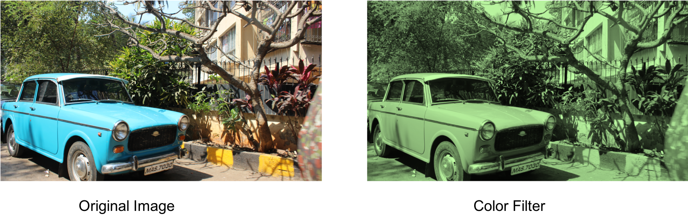

## filterizeR
This is a comprehensive meme generation package based in R.

**Date:** 2019-02-05

**License:** [MIT](https://opensource.org/licenses/MIT)

#### Authors

|Contributors |Jack Yang| Akansha Vashisth |Chao Wang|
|---|---|---|----|
|github handle|[@jackattackyang](https://github.com/jackattackyang)|[@akanshaVashisth](https://github.com/akanshaVashisth)|[@chaomander2018](https://github.com/chaomander2018)|

### Overview

This is a Collaborative Software Development Project in which we will be working on three image processing filters using convolutions.

### Functions

- #### Green Color Filter
This green color filter converts the original image to a green scaled image.
Please see the original image and processed image below.

- #### Sharpen Filter
This sharpen filter function will use convolution to convert the original image to a sharpened image.

- #### Mirror Filter
This mirror filter function will use convolution to convert the original image to a mirrored image i.e. the left side of the image will be tranformed into the right side and the right side of the original image will be transformed into the left side.

### R Ecosystems
There are many packages that perform image processing for accessorizing, color enhancement or special effects. In fact, the idea for this project came from the MDS cohort from last year. The intent behind this project is to build onto the intuition behind convolutional neural networks and how image filtering works while working on a relevant and practical project.
* [MDS package 2018](https://github.com/UBC-MDS/InstaR/tree/v4.0)
* [Zomato Android filter](https://github.com/Zomato/AndroidPhotoFilters)

## Pack Dependencies:
None

## Reference:
Image Source: [tiffen.com](https://tiffen.com/wp-content/uploads/2016/03/Graduated-ND-Yosemite.jpg)
