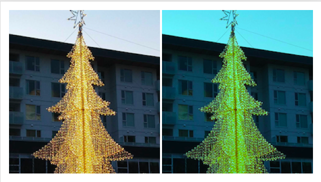
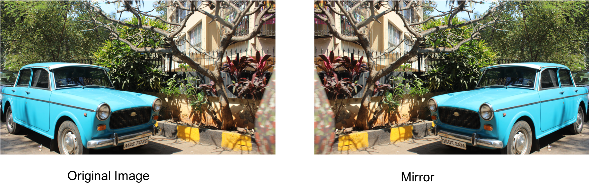
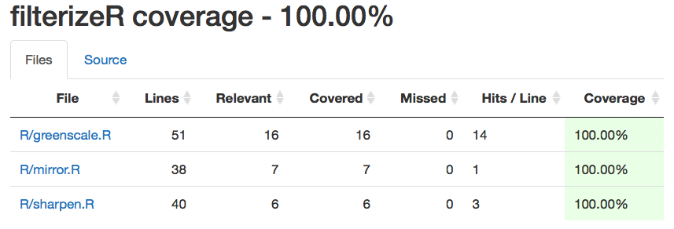
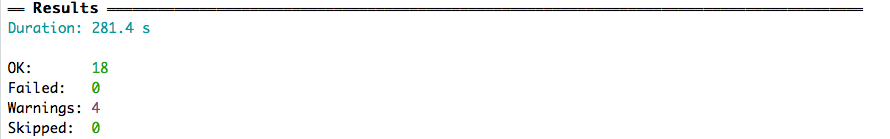

## filterizeR
This is a comprehensive image filter package based in R.

**Date:** 2019-03-03

**License:** [MIT](https://opensource.org/licenses/MIT)

#### Authors

|Contributors |Jack Yang| Akansha Vashisth |Chao Wang|
|---|---|---|----|
|github handle|[@jackattackyang](https://github.com/jackattackyang)|[@akanshaVashisth](https://github.com/akanshaVashisth)|[@chaomander2018](https://github.com/chaomander2018)|

### Overview

This is a Collaborative Software Development Project in which we will be working on three image processing filters using convolutions.

### Functions

- #### Green Color Filter `greenscale()`
This green color filter converts the original image to a green scaled image.
Please see the original image and processed image below.

- #### Sharpen Filter `sharpen_image()`
This sharpen filter highlights edges and fine details in an image.

- #### Mirror Filter `mirror()`
This mirror filter function will use convolution to convert the original image to a mirrored image i.e. the left side of the image will be transformed into the right side and the right side of the original image will be transformed into the left side.

## Installation
- Please check whether you have installed `devtools` in R.
- Second, `install.packages("BiocManager")` so you can install the EBImage Dependencies `BiocManager::install("EBImage")`
- To install `filterizeR` package, run the following line on your R console:
`devtools::install_github("UBC-MDS/filterizeR",build_vignettes = TRUE)`

## Usage
Note: .png inputs required
load `filterizeR` package
library(filterizeR)

1. `greenscale(input_path)`
 - Argument: `input_path`, path to the input image
 - Expected Output: `"img/toy_img/greenscale_toy.png"`
 - Example Usage:`greenscale("img/toy_img/gs_greenscale_toy.png")`

2. `sharpen(input_path)`
 - Argument: `input_path`, path to the input image
 - Expected Output: `img/toy_img/sharpened_sharpen_toy.png`
 - Example Usage:`sharpen("img/toy_img/sharpen_toy.png")`

3. `mirror(input_path)`
 - Argument: `input_path`, path to the input image
 - Expected Output: `img/toy_img/mirrored_mirror_toy.png`
 - Example Usage:`mirror("img/toy_img/mirror_toy.png")`

## Branch coverage test results
Using 'covr' package, all our three functions achieve 100% branch overage. Please see results below.

## Toy Dataset
Out toy images are located in the 'toy_img' folder in the within the 'img' folder. You can find them [here](img/toy_img).

## Test results

## Pack Dependencies:
- testthat
- reader
- imager
- EBImage
- devtools
- usethis
- stringr
- lattice
- magrittr
- dplyr
- BiocManager
- rlang

## Reference:
Image Sources:
- [filterize.net](https://filterize.net/wp-content/uploads/2018/02/logo_text_bottom-2.png)
- [quickmeme](http://www.quickmeme.com/img/2f/2f516b33efd7251b57bad254f1688131458e13d005972810676ea9622a6c4d29.jpg)
